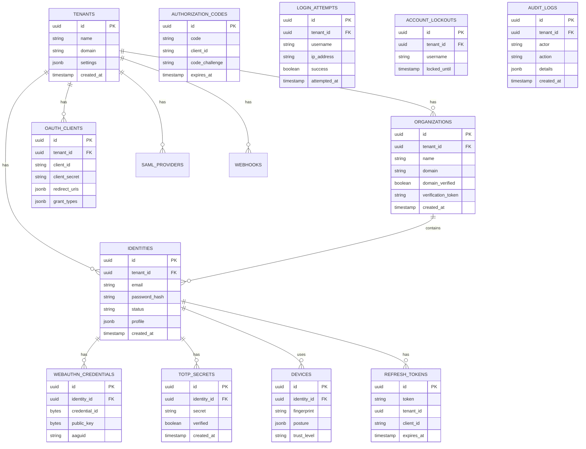
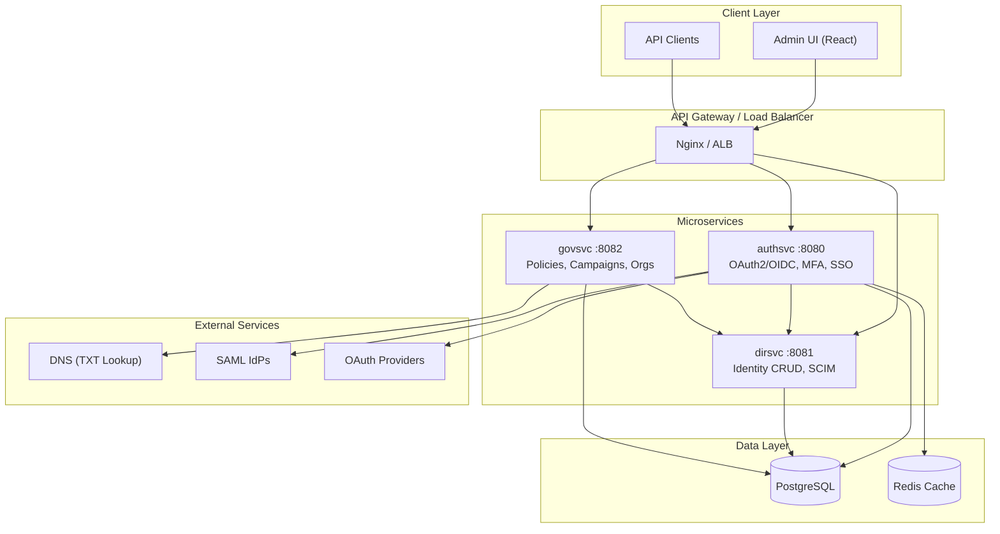
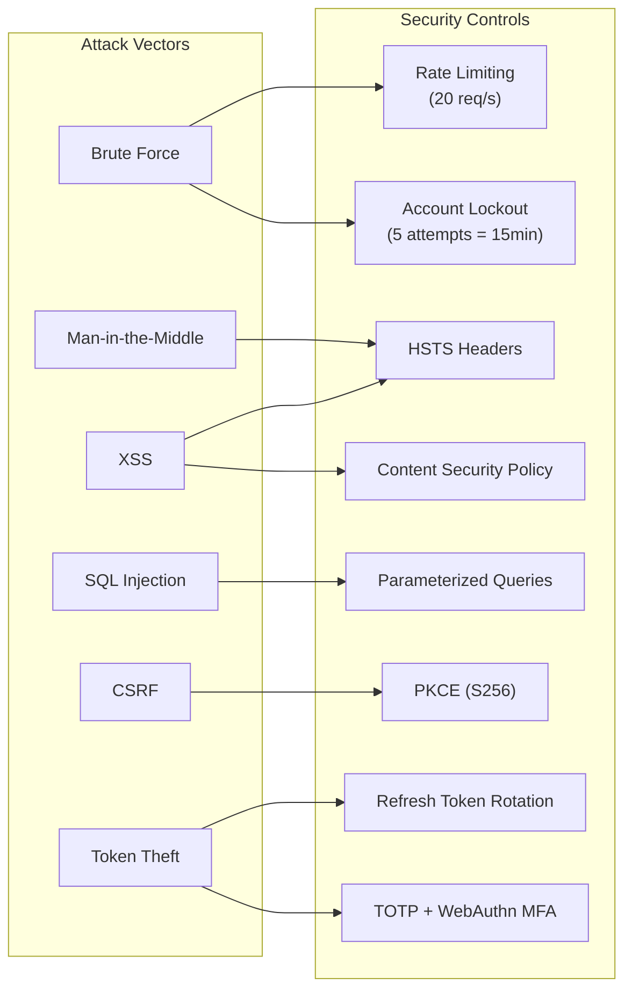
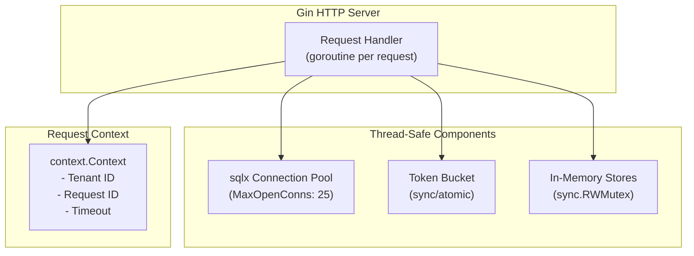

# WardSeal Architecture Documentation

## 1. Data Model (ER Diagram)



---

## 2. Service Architecture



### Service Responsibilities

| Service | Port | Responsibilities |
|---------|------|------------------|
| **authsvc** | 8080 | OAuth2/OIDC, Login, MFA (TOTP, WebAuthn), SAML SSO, Tokens |
| **dirsvc** | 8081 | Identity CRUD, Password validation, SCIM 2.0 provisioning |
| **govsvc** | 8082 | Access Requests, Campaigns, Roles, Audit, Organizations |

---

## 3. Threat Model



### Security Controls Summary

| Threat | Control | Implementation |
|--------|---------|----------------|
| Brute Force | Rate Limiting | `middleware.RateLimitMiddleware(20, 40)` |
| Brute Force | Account Lockout | `login_attempt_store.go` - 5 failures = 15min lock |
| CSRF | PKCE | S256 code challenge in OAuth2 flow |
| XSS | Security Headers | `SecurityHeadersMiddleware()` - CSP, X-Frame-Options |
| SQL Injection | Parameterized Queries | `sqlx` with `$1, $2` placeholders |
| Token Theft | MFA | TOTP + WebAuthn enforcement |
| Token Theft | Rotation | Refresh tokens rotated on use |
| Session Hijack | Device Binding | Device fingerprint + trust scoring |

---

## 4. Concurrency Model



### Concurrency Patterns

| Component | Pattern | Details |
|-----------|---------|---------|
| **HTTP Server** | Goroutine per request | Gin spawns goroutine for each incoming request |
| **Database** | Connection Pool | `sqlx.DB` manages pool (default 25 open, 10 idle) |
| **Rate Limiter** | Token Bucket | `golang.org/x/time/rate` - atomic operations |
| **In-Memory Stores** | RWMutex | `sync.RWMutex` for maps (codes, tokens, revocations) |
| **Context** | Deadline Propagation | `context.Context` with timeout passed to all stores |
| **Background Jobs** | N/A | No background workers currently (migrations sync) |

### Thread Safety

```go
// In-memory store example (service.go)
type authorizationCodeStore struct {
    mu    sync.RWMutex  // Reader-writer lock
    codes map[string]authorizationCode
}

func (s *authorizationCodeStore) Get(ctx context.Context, code string) (authorizationCode, bool, error) {
    s.mu.RLock()         // Multiple readers OK
    defer s.mu.RUnlock()
    c, ok := s.codes[code]
    return c, ok, nil
}

func (s *authorizationCodeStore) Save(ctx context.Context, code authorizationCode) error {
    s.mu.Lock()          // Exclusive write lock
    defer s.mu.Unlock()
    s.codes[code.Code] = code
    return nil
}
```

---

## Quick Reference

| Metric | Value |
|--------|-------|
| Services | 3 (authsvc, dirsvc, govsvc) |
| Database Tables | 20+ |
| API Endpoints | 50+ |
| Auth Methods | Password, TOTP, WebAuthn, SAML, Social |
| Rate Limit | 20 req/s per IP |
| Lockout Threshold | 5 failed attempts |
| Token Expiry | Access: 1h, Refresh: 7d |
